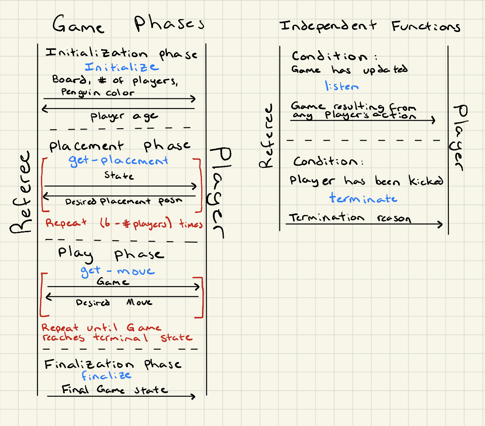

## Player Protocol  
The protocol that the Referee will use to interact with a Player is as follows:

#### Functions  
There are 6 functions that the Referee may call on a Player.
- `initialize`
  - Informs the Player that a game with the given board and number of Players will begin, and that the Player's penguin avatars will have the given color. The Player returns it's age in years.
- `get-placement`
  - Informs the player of the current `State`. The Player returns it's next desired placement for a penguin.
- `get-movement`
  - Informs the player of the current `Game`. The Player returns it's next `Move`.
- `finalize`
  - Informs the player of the final `EndGame`, which is guaranteed to be terminal (no more moves can be made).
- `listen`
  - Informs the player of the new `GameTree` any time any Player performs an action that produces a new `GameTree`.
- `terminate`
  - Informs the player that it has been kicked from the game, with a provided reason which the Player may desire to log.

#### Order of Function Calls  
The order of function calls will be dependent on the phase of the game. The following phases are in order:

##### Initialization phase  
`initialize` will be called once on each Player as a game of Fish is beginning.

##### Placement phase  
`get-placement` will be called (6 - N) times in total for a single Player, where N is the number of Players in the game. It will be called according to the play order† in a round-robin fashion until each Player in the game has placed all of its penguins.

##### Play phase
`get-move` will be called according to the play order† in a round-robin fashion until an `EndGame` has been reached.

##### Finalization phase
`finalize` will be called once on each Player, providing the `EndGame`.

##### Termination
During the Placement phase and beyond, a Player may perform a move which violate the rules of Fish. The Referee will call `terminate` once on this player, providing a string reason for which the Player was kicked, and then remove this Player from the `Game`.

##### Listening
Players may use algorithms which utilize all available time searching for optimal moves given the currently known `GameTree`. To accommodate this, each time a Player action causes the current `GameTree` to progress, `listen` will be called once for each player providing the newest `GameTree`. Players may safely perform a no-op return on this function.

#### Notes  
†Play order: As per the [rules](https://www.ccs.neu.edu/home/matthias/4500-f20/fish.html) the Players take turns in ascending order of their age. If a Player is kicked, their turn is skipped each round.  

`State` is defined [here](). TODO  
`GameTree`, `Game`, and `EndGame` are defined [here]()
`Move` is defined [here](). TODO  
`Color` is defined [here](). TODO

- The Referee will only send well formed, valid data to a Player as arguments to each function specified in the Player Interface.
- During the initialization phase, a set of `Color`s will be determined for the game. Each Player will be assigned a `Color` when `initialize` is called on that Player.
- If a Player provides a return value to `get-placement` or `get-move`, the Referee may kick this Player from the game. Their penguins will be removed from the `Game`, and their turn will be skipped each round.  
- `finalize` will only be called with an `EndGame`.
