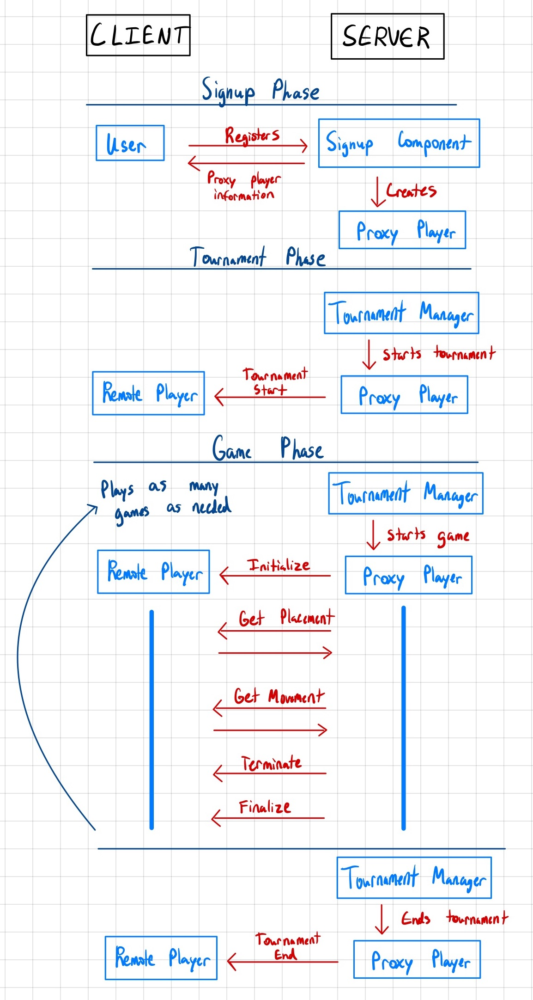

# Remote Collaboration Protocol

We will use the remote proxy pattern to translate communication over the network into method calls
and vice versa. On the Admin side, we will develop a `remote player` that implements the existing
`player-interface`. When methods are called on the `remote player`, it will serialize the
arguments and send the over the network to the player. On the Client side, we will create a Racket
library that wraps the communication and calls the appropriate methods on the `player-interface`
implemented by the user. Note that users can also register remote players implemented in any
language, as long as they follow our communication protocol.

At signup, the server component will create a proxy player that the newly signed up player can use
to interact with tournament manager and referees.

## Interaction Diagram

## Message Protocol

All of the following messages are from the server to remote clients.

A connection will exist for clients to communicate with a proxy player using the following messages.
The server will always send the message first, and clients are expected to acknowledge the message
and provide a response payload when the protocol requires.

All of the following objects will be serialized to a standard JSON schema, to be specified later.

### `tournament-started : natural? -> void?`

Informs the client that the tournament is starting and provides the total number of players in the
tournament. No payload should be sent back.

### `initialize : board? natural? penguin-color? void?`

Informs the client that a game is about to start, providing the starting board, number of players in
the game, and their penguin color for the game. No payload should be sent back.

### `get-placement : state? -> posn?`

Requests a placement from the client for the given state in the game they have been playing. The
client should provide a valid position in the returned payload.

### `get-move : state? -> move?`

Requests a move from the client for the given state in the game they have been playing. The client
should provide a valid move in the returned payload.

### `terminate : void? -> void?`

Informs the client they have cheated in the game they have been playing and will be kicked from the
tournament. No payload should be sent back and any acknowledgement will be ignored.

### `finalize : state? -> void?`

Informs the client that the game they have been playing has ended, and provides the last state in
the game. No payload should be sent back.

### `tournament-ended : boolean? -> void?`

Informs the client that the tournament is ending and tells them whether or not they were a winner in
the tournament. No payload should be sent back.

## Timing of the protocol

1. A signup component creates a proxy player when players signup. Players have to implement the communication protocol to talk to the proxy player for all interactions.
2. When a tournament is started, the tournament manager sends the `tournament-started` to each player.
3. For each game in a tournament round, the tournament manager creates a referee and passes it the proxy players.
4. The referee sends the `initialize` to each player.
5. The referee sends `get-placement` and `get-move` as the game progresses.
6. If players misbehave, the referee sends `terminate`.
7. When the game ends, the referee sends `finalize`.
8. As the tournament progresses, steps 3-7 are repeated until the winners are determined.
9. When the tournament ends, the tournament manager sends the `tournament-ended` to remaining active players.

- TODO TOURNAMENT INTERFACE
- TODO maybe sets
- TODO things in email from last milestone
- TODO run on ccis server
